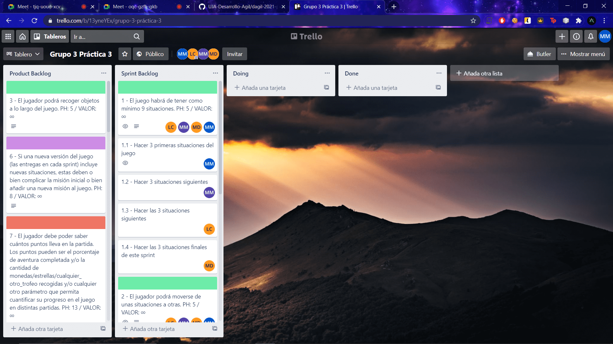

# Práctica 3 Desarrollo ágil

## Miembros

* Hidalgo Morcillo, María - mhm00037@red.ujaen.es.
* García Calderón, Laura - lgc00060@red.ujaen.es.
* Camacho Moral, Mario - mcm00155@red.ujaen.es.
* Gallardo Delgado, Maria José - mjgd0007@red.ujaen.es.

# Sprint 0

## Descripción del juego

### Título - Daniela y El Tesoro De Libertalia

La historia cuenta la aventura de una joven cazatesoros llamada Daniela Colby. Lleva años retirada de su mayor afición pero una carta avisando
de que se han encontrado pistas sobre la localización de Libertalia, la mayor colonia de piratas donde todos los piratas pertenecientes a ella dejaban sus tesoros, hace que vuelva a retomar los mares. Tendrás que tomar decisiones para poder conseguir el máximo alijo posible y hacer que Daniela sea reconocida en el mundo como también lo fue su padre pero también habrá peligros que tendrá que salvar o morirá. Tu eliges.

Para completar el juego al 100% debes hacerte con el máximo tesoro posible que son 50000 monedas de plata y 100000 monedas de oro. Debes ser muy hábil para conseguirlo. Buena suerte.

## Trello

El enlace al tablero de esta práctica es [este](https://trello.com/b/13yneYEx/grupo-3-pr%C3%A1ctica-3)

### Backlog

Capturas de imagen de nuestro tablero Trello

## Telegram

Capturas de imagen de vinculación de Trello y GitHub con Telegram

# Sprint 1

## Trello

### Captura de Pantalla sobre Sprint Backlog

Para este sprint en un primer momento, antes del Product Backlog Refinement, teniamos que hacer 3 historias de uso que eran las siguientes:

* El juego habrá de tener como mínimo 9 situaciones. Hemos elegido esta ya que tenemos que hacer las situaciones de la historia para que tome forme y esta historia de uso es vital para eso, de ahí que sea innegociable.

* El jugador podrá moverse de unas situaciones a otras. Hemos elegido esta ya que el personaje tendrá que avanzar en la historia y para eso tendrá que cambiar de situacion varias veces, de ahí que además sea innegociable también.

* Se añadirá música de fondo al juego. Hemos elegido esta ya que la música dará ambiente de aventura a la historia y nos meterá de lleno en el juego.

Para este primer sprint haremos 12 situaciones de un total de 24 situaciones que tiene la historia del juego.

### Capturas de Pantalla de Product Backlog y Sprint Backlog tras hacer Product Backlog Refinement

Tras hacer el Product Backlog Refinement y ver que había nuevas historias de uso, las metimos en el Product Backlog y les dimos valor. Una vez hecho eso, añadimos 2 historias de uso al sprint que son las siguientes:

* Se deberá modificar el CSS del juego original, usando otras fuentes de letra, fondos de pantalla, etc. Hemos elegido esta ya que necesitamos que la apariencia llame la atención del usuario para que este se decida a jugar a nuestro juego y es importante tenerlo ya hecho.

* Cada situación deberá llevar una imagen descriptiva asociada. Hemos elegido esta ya que una imagen en cada situación ayudará al jugador a identificar donde se encuentra exactamente y aclarará cualquier duda que tuviera acerca del momento que atraviesa el juego.

### Captura de Pantalla de las historias de uso del Sprint Backlog descompuestas en tareas

En este apartado hemos descompuesto aquellas historias de uso que creiamos que se dividian en varias tareas.

### Actualización sobre Sprint Backlog

Se ha quitado la historia de uso sobre la recogida de objetos a lo largo del juego. El motivo es simplificar los sprints y no agobiarnos con cada entrega. A continuación se verá la captura de Trello con la modificación.

### Conclusiones obtenidas en la Sprint Review

Las conclusiones obtenidas tras haber hecho el Sprint Review entre todos han sido las siguientes:

- Se han hecho todas las historias de uso que se propusieron en el Sprint Backlog, sin dejar ninguna incompleta.

- En general, la inclusión de situaciones por parte de todos los miembros del equipo ha sido satisfactoria y no ha surgido ningún problema grave. Los pocos errores obtenidos han sido algún fallo al añadir situaciones en tutorial.game.es.js y al añadir las extensiones de las imágenes. Lo solucionamos revisando el texto añadido y corrigiendo los errores de escritura.

- Como se puede comprobar, el incremento es evidente, ya que empezamos desde cero y en este Sprint acabamos con el juego medio terminado.

- En el siguiente Sprint seguiremos con la otra mitad del juego, añadiendo las situaciones restantes y dandole nuevas funcionalidades como exigen las historias de uso que faltan.

- Las historias de uso que quedan, las cuáles aportan más valor, son el poder recoger objetos o también que las situaciones siguientes compliquen la historia inicial.

- En cuanto a los plazos, hemos ido bien de tiempo y no nos hemos visto apurados.

### Conclusiones obtenidas en la Sprint Retrospective

#### ¿Qué ha ido bien?

En general, las tareas repartidas entre todos los miembros del grupo y las tareas comunes han sido satisfactorias. Como hemos abordado en el Sprint Review, los fallos han sido mínimos y muy leves por lo que nuestra evaluación en este Sprint ha sido muy positiva.

#### ¿Qué se puede mejorar?

Hemos tenido pocos fallos y de carácter leve. Se puede mejorar los plazos para hacer el Sprint ya que empezamos con retraso y además tuvimos que debatir la historia del juego y cómo nos íbamos a organizar.

#### ¿Qué nos comprometemos a mejorar para el próximo Sprint?

Nos comprometemos a ponernos con el Sprint siguiente con menos retraso que este Sprint para así aprovechar mejor el tiempo y mejorar la organización de las tareas.

### Captura de pantalla de las tareas del Sprint Planning al final del sprint

Como se puede comprobar en la captura, todas las historias de uso programadas para este Sprint se han realizado satisfactoriamente. En la captura también se puede ver que miembro del grupo ha realizado la tarea.

### Captura de pantalla de las HU del Product Backlog una vez acabado el Sprint

# Sprint 2

## Trello

### Captura de Pantalla sobre Sprint Backlog y descomposición de tareas

Para este sprint en un primer momento, antes del Product Backlog Refinement, teniamos que hacer 6 historias de uso que eran las siguientes:

* El jugador podrá recoger objetos a lo largo del juego. Hemos elegido esta ya que para avanzar en la historia y conseguir el tesoro tenemos que recoger objetos.

* Si una nueva versión del juego (las entregas en cada sprint) incluye nuevas situaciones, estas deben o bien complicar la misión inicial o bien añadir una nueva misión al juego. Hemos elegido esta para complicar al usuario la historia y que sus elecciones tengan un mayor peso en el desenlace.

* El jugador debe poder saber cuántos puntos lleva en la partida. Los puntos pueden ser el porcentaje de aventura completada y/o la cantidad de monedas/estrellas/cualquier_ otro_trofeo recogidas y/o cualquier otro parámetro que permita cuantificar su progreso en el juego en distintas partidas. Hemos elegido esta para cuantificar la cantidad de tesoro que el usuario consigue. Para conseguir el 100% del progreso de juego se deberá conseguir el tesoro en su totalidad. Puede ser que haya tesoro escondido.

* En al menos una situación (de las existentes o incluyendo alguna/s nueva/s), se podrá establecer un diálogo con otro personaje del juego (con preguntas y respuestas predefinidas, por supuesto, dado que serán acciones del juego; no se trata de implementar un chatbot). Hemos elegido esta para añadirle a la historia un toque de emoción extra y hacer que el usuario pueda decidir sobre las emociones de Daniela.

* El jugador podrá usar objetos para resolver puzzles. Hemos elegido esta ya que necesitamos de algunos objetos para seguir avanzando o completar la historia. Sin ellos, puede que no podamos avanzar.

* El jugador podrá usar la acción “mirar detalladamente” (u otra similar) para poder descubrir nuevas cosas en las situaciones que no se le hayan descrito a primera vista. Hemos elegido esta ya que el tesoro puede estar (o no) oculto en alguna parte de la historia.

Para este primer sprint haremos 12 situaciones de un total de 24 situaciones que tiene la historia del juego.

